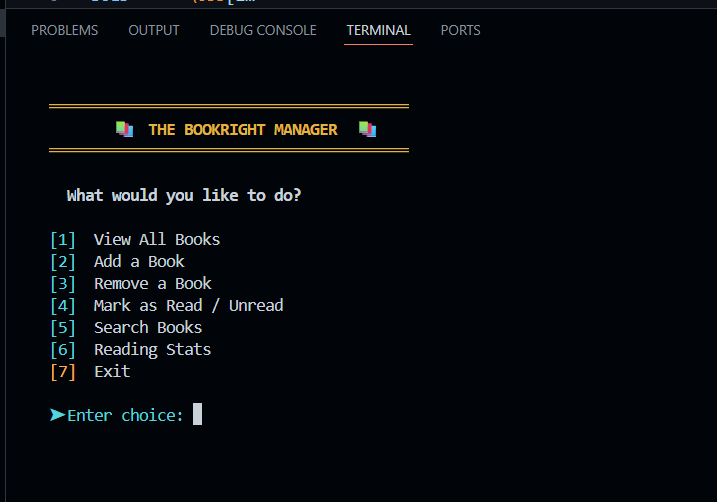
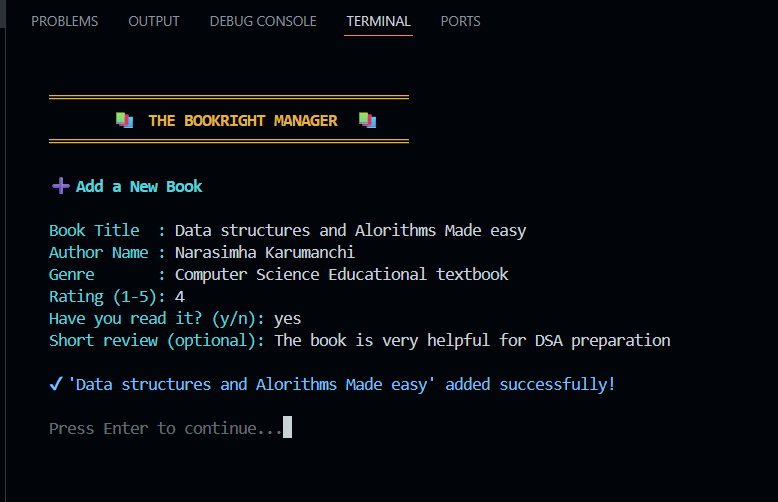
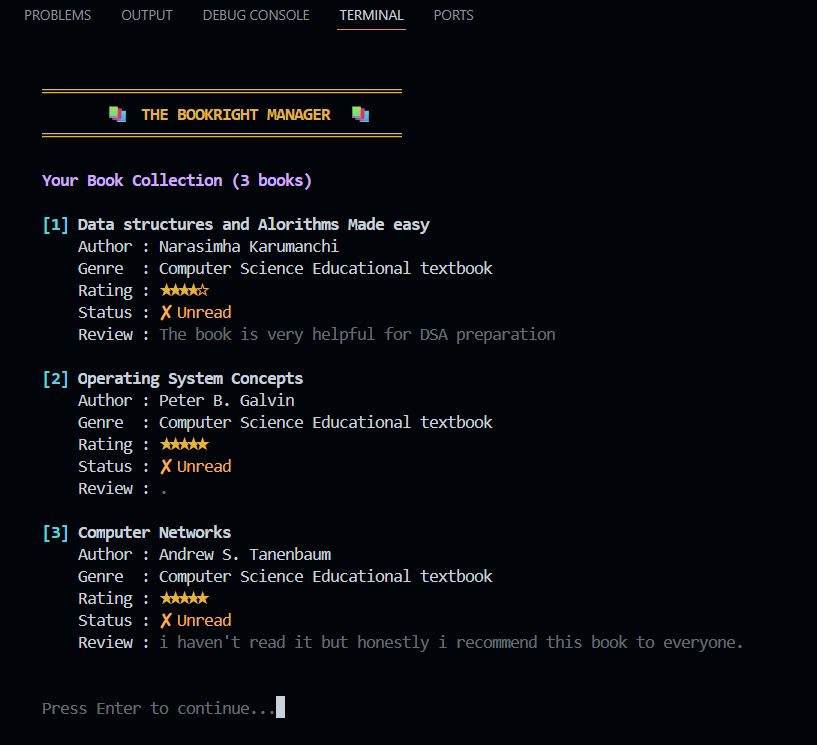
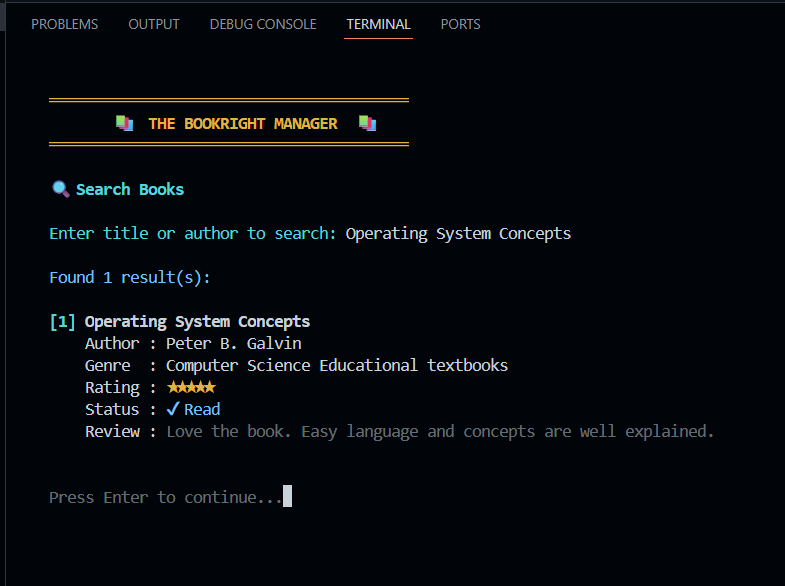
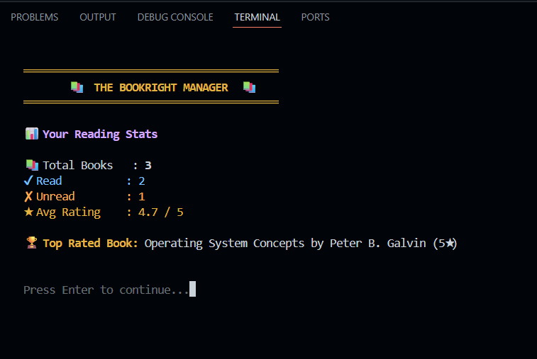

# 📚 Bookright Manager

A console-based Python application for managing and organizing your personal book collection, built with simple JSON-based data storage for persistence.

---

## 🚀 Features

- ➕ Add new books to your collection
- 📋 View all books in your library
- 🗑️ Remove books from the collection
- ✅ Mark books as read or unread
- 🔍 Search books by title or author
- 📊 View reading statistics (total books, read vs unread)
- 💾 Persistent storage using JSON

---

## 🛠️ Tech Stack
- Python
- JSON
- File Handling
- Object-Oriented Programming (OOP)

---

## Project Type
Console-Based Application

---

## Screenshots

### Main Menu


---

### Add a New Book


---

### View Books


---

### Search Books


---

### Reading Statistics


---

## 📂 Project Structure
bookright-Manager/

│

├── Bookright manager.py

├── books.json

└── README.md

---

## ⚙️ Installation & Usage

### Clone the Repository

```bash
git clone https://github.com/Nancy-sharma01/bookright-Manager.git
cd bookright-Manager
```

### Run the Application

```bash
python "Bookright manager.py"
```

No additional dependencies required — runs with Python's standard library.

---

## 💡 How It Works

Bookright Manager stores all book records in `books.json`, allowing data to persist between sessions. Users interact through a simple command-line menu to add, search, update, or remove books, and can view quick statistics about their reading progress.

---

## 📂 Project Structure
bookright-Manager/

│

├── Bookright manager.py

├── books.json

└── README.md

---

## ⚙️ Installation & Usage

### Clone the Repository

```bash
git clone https://github.com/Nancy-sharma01/bookright-Manager.git
cd bookright-Manager
```

### Run the Application

```bash
python "Bookright manager.py"
```

No additional dependencies required — runs with Python's standard library.

---

## 💡 How It Works

Bookright Manager stores all book records in `books.json`, allowing data to persist between sessions. Users interact through a simple command-line menu to add, search, update, or remove books, and can view quick statistics about their reading progress.

---

## 👩‍💻 Developer

**Nancy Sharma**
B.Tech Computer Science & Engineering Student

---

⭐ *If you found this project useful, consider giving it a star!*
